# Palette: Image-to-Image Diffusion Models

[Paper](https://arxiv.org/pdf/2111.05826.pdf ) |  [Project](https://iterative-refinement.github.io/palette/ )

## Brief

This is an unofficial implementation of **Palette: Image-to-Image Diffusion Models** by **Pytorch**, and it is mainly inherited from its super-resolution version [Image-Super-Resolution-via-Iterative-Refinement](https://github.com/Janspiry/Image-Super-Resolution-via-Iterative-Refinement). The code template is from my another seed project: [distributed-pytorch-template](https://github.com/Janspiry/distributed-pytorch-template).

There are some implementation details with paper descriptions:

- We adapted the U-Net architecture used in  `Guided-Diffusion`, which give a substantial boost to sample quality.
- We used the attention mechanism in low-resolution features (16×16) like vanilla `DDPM`.
- We encode the $\gamma$ rather than $t$ in `Palette` and embed it with affine transformation.
- We fix the variance $Σ_\theta(x_t, t)$ to a constant during the inference as described in `Palette`.

## Status

### Code
- [x] Diffusion Model Pipeline
- [x] Train/Test Process
- [x] Save/Load Training State
- [x] Logger/Tensorboard
- [x] Multiple GPU Training (DDP)
- [x] EMA
- [x] Metrics (now for FID, IS)
- [x] Dataset (now for inpainting, uncropping, colorization)

### Task

I try to finish following tasks in order:
- [x] Inpainting on [CelebaHQ](https://drive.google.com/drive/folders/1CjZAajyf-jIknskoTQ4CGvVkAigkhNWA?usp=sharing)🚀 (available)
- [x] Inpainting on [Places2 with 128×128 centering mask](https://drive.google.com/drive/folders/1fLyFtrStfEtyrqwI0N_Xb_3idsf0gz0M?usp=sharing)🚀 (available)
- [ ] Uncropping on Places2🔥 
- [ ] Colorization on ImageNet val set 

## Results

Due to the lack of computational resources, we reduced the model parameters, while it does not fully converge. It leaves a lot of room for optimization. However, we can feel the excellent performance of this method through the stage results.

### Visuals

#### Celeba-HQ

Results with 200 epochs and 930K iterations, and the first 100 samples in [centering mask](https://drive.google.com/drive/folders/10zyHZtYV5vCht2MGNCF8WzpZJT2ae2RS?usp=sharing) and [irregular mask](https://drive.google.com/drive/folders/1vmSI-R9J2yQZY1cVkSSZlTYil2DprzvY?usp=sharing). 

| 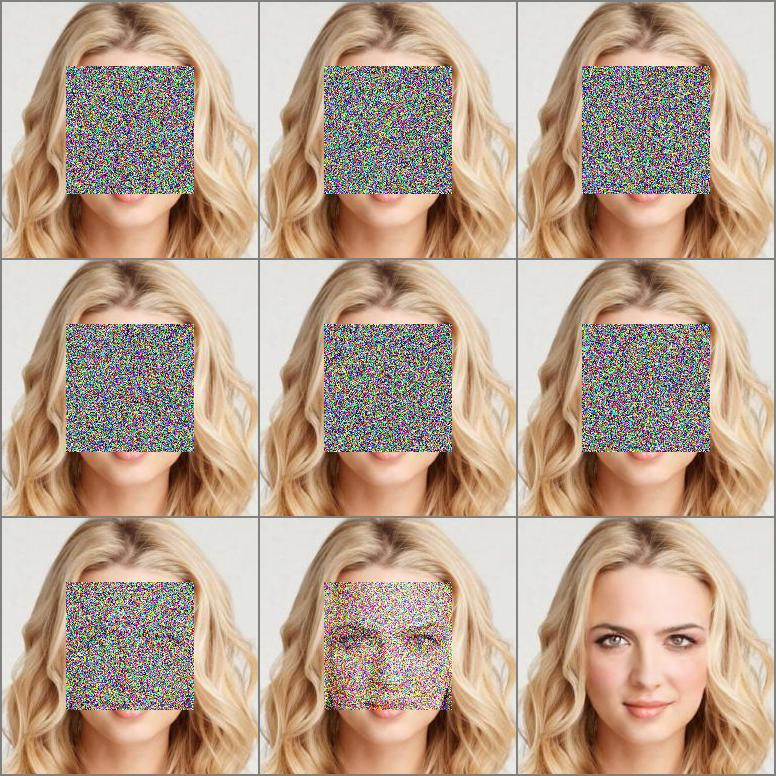 |    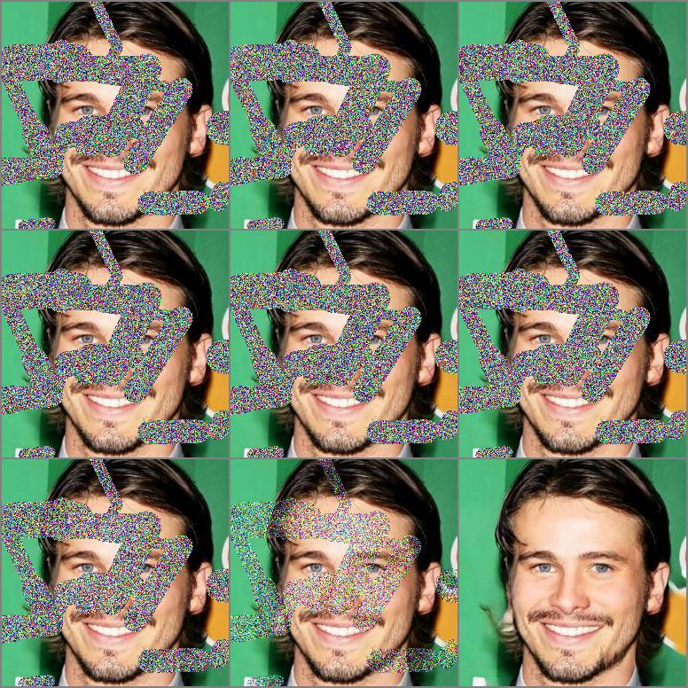  |
| ------------------------------------------------ | ---- |

#### Places2 with 128×128 centering mask

Results with 16 epochs and 660K iterations, and the several **picked** samples in [centering mask](https://drive.google.com/drive/folders/1XusKO0_M6GUfPG-FOlID0Xcp0SiexKNe?usp=sharing).

| 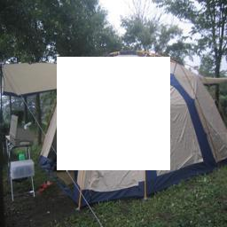 | 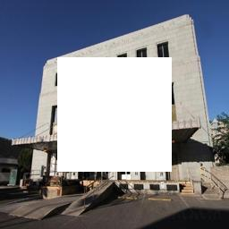 | 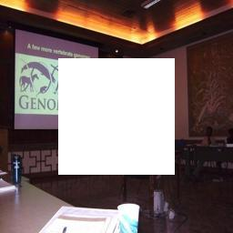 |  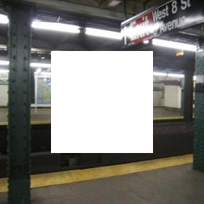    |
| ------------------------------------------------------------ | ------------------------------------------------------------ | ------------------------------------------------------------ | ---- |
| 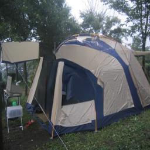 | 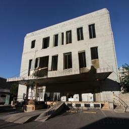 | 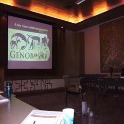 | 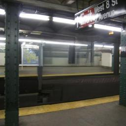    |

#### Uncropping on Places2

Results with 8 epochs and 330K iterations, and the several  **picked** samples in [uncropping](https://drive.google.com/drive/folders/1tC3B8ayaadhXAJrOCTrw15R8t84REPWJ?usp=sharing).
| 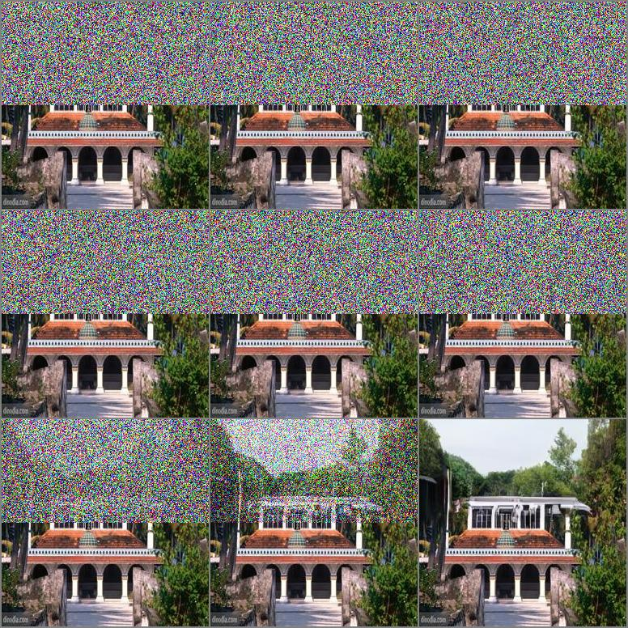 |    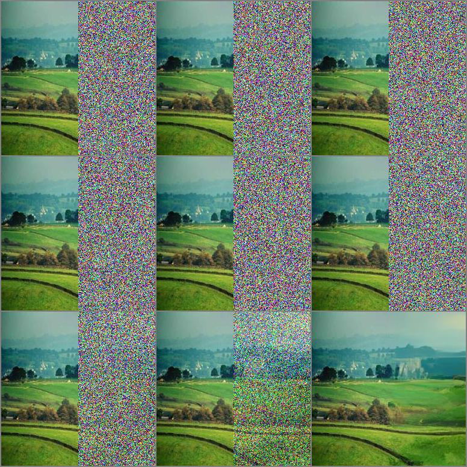  |
| ------------------------------------------------ | ---- |


### Metrics

| Tasks        | Dataset | EMA | FID(-) | IS(+) |
| -------------------- | ----------- | -------- | ---- | -------------------- |
| Inpainting with centering mask | Celeba-HQ | False | 5.7873 | 3.0705 |
| Inpainting with irregular mask | Celeba-HQ | False | 5.4026 | 3.1221 |
| Inpainting with centering mask | Places2 | False |  |        |
| Uncropping | Places2 | True |  |  |

## Usage
### Environment
```python
pip install -r requirement.txt
```

### Pre-trained Model

| Dataset   | Task       | Iterations | URL                                                          |
| --------- | ---------- | ---------- | ------------------------------------------------------------ |
| Celeba-HQ | Inpainting | 930K       | [Google Drive](https://drive.google.com/drive/folders/13YZ2UAmGJ-b7DICr-FDAPM7gctreJEoH?usp=sharing) |
| Places2   | Inpainting | 660K       | [Google Drive](https://drive.google.com/drive/folders/1Vz_HC0LcpV6yMLOd-SXyoaqJHtxyPBxZ?usp=sharing) |


### Data Prepare

We get most of them from Kaggle, which may be slightly different from official  version, and you also can download them from official website.
- [CelebA-HQ resized (256x256) Kaggle](https://www.kaggle.com/datasets/badasstechie/celebahq-resized-256x256)
- [Places2 Official](http://places2.csail.mit.edu/download.html) | [Places2 Kaggle](https://www.kaggle.com/datasets/nickj26/places2-mit-dataset?resource=download)
- [ImageNet Official](https://www.image-net.org/download.php)

We use the default division of these datasets for training and evaluation. The file lists we use can be found in [Celeba-HQ](https://drive.google.com/drive/folders/1-ym2Mi2jVKdWmWYKJ_L2TWXjUQh8z7H-?usp=sharing), [Places2](https://drive.google.com/drive/folders/11Qj2MtRfiD7LbKEveYwOLaiX62lm_2ww?usp=sharing).

After you prepared own data, you need to modify the corresponding configure file to point to your data. Take the following as an example:

```yaml
"which_dataset": {  // import designated dataset using arguments 
    "name": ["data.dataset", "InpaintDataset"], // import Dataset() class
    "args":{ // arguments to initialize dataset
    	"data_root": "your data path",
    	"data_len": -1,
    	"mask_mode": "hybrid"
    } 
},
```

More choices about **dataloader** and **validation split** also can be found in `datasets`  part of configure file.

### Training/Resume Training
1. Download the checkpoints from given links.
1. Set `resume_state` of configure file to the directory of previous checkpoint. Take the following as an example, this directory contains training states and saved model:

```yaml
"path": { //set every part file path
	"resume_state": "experiments/inpainting_celebahq_220426_150122/checkpoint/100" 
},
```
2. Set your network label in `load_everything` function of `model.py`, default is **Network**. Follow the tutorial settings, the optimizers and models will be loaded from 100.state and 100_Network.pth respectively.

```python
netG_label = self.netG.__class__.__name__
self.load_network(network=self.netG, network_label=netG_label, strict=False)
```

3. Run the script:

```python
python run.py -p train -c config/inpainting_celebahq.json
```

We test the U-Net backbone used in `SR3` and `Guided Diffusion`,  and `Guided Diffusion` one have a more robust performance in our current experiments.  More choices about **backbone**, **loss** and **scheduler** can be found in `which_networks`  part of configure file.

### Test

1. Modify the configure file to point to your data following the steps in **Data Prepare** part.
2. Set your model path following the steps in **Resume Training** part.
3. Run the script:
```python
python run.py -p test -c config/inpainting_celebahq.json
```

### Evaluation
1. Create two folders saving ground truth images and sample images, and their file names need to correspond to each other.

2. Run the script:

```python
python eval.py -s [ground image path] -d [sample image path]
```


## Acknowledge
Our work is based on the following theoretical works:
- [Denoising Diffusion Probabilistic Models](https://arxiv.org/pdf/2006.11239.pdf)
- [Palette: Image-to-Image Diffusion Models](https://arxiv.org/pdf/2111.05826.pdf)
- [Diffusion Models Beat GANs on Image Synthesis](https://arxiv.org/abs/2105.05233)

and we are benefiting a lot from the following projects:
- [openai/guided-diffusion](https://github.com/openai/guided-diffusion)
- [LouisRouss/Diffusion-Based-Model-for-Colorization](https://github.com/LouisRouss/Diffusion-Based-Model-for-Colorization)
